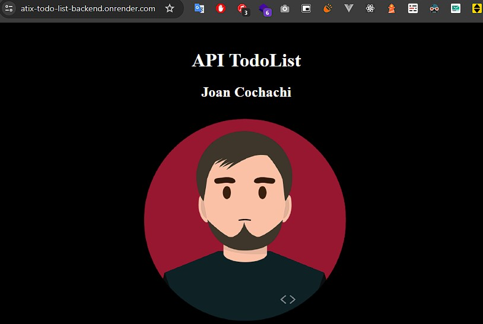
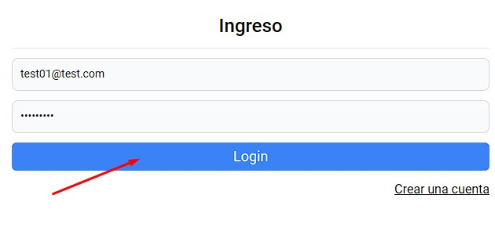
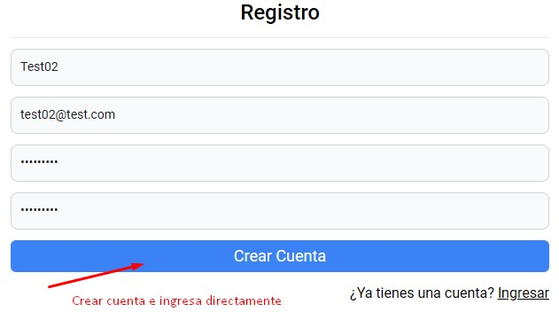
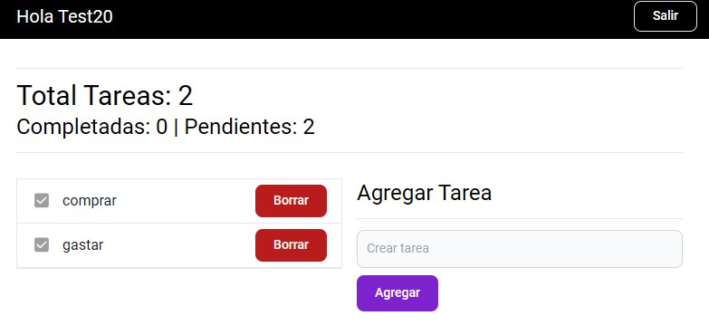

# Atix todoList
El proyecto cuenta con 2 repositorios [frontend](https://github.com/joanccresources/atix-todo-list-frontend)<span style="font-size: 12px">(Donde estamos ahora)</span> y [backend](https://github.com/joanccresources/atix-todo-list-backend).

## Demostracion
- Para probar el proyecto desde Produccion primero debemos habilitar la API que esta subida en 'render.com' asi que debemos ingresar a este [enlace](https://atix-todo-list-backend.onrender.com/) y esperar a que cargue. (Al ser un servidor gratuito puede tardar hasta 1 minuto la primera carga)
  - 

- Ahora ingresamos a nuestra Frontend Web [https://joanccresources.github.io/atix-todo-list-frontend/#/auth/login](https://joanccresources.github.io/atix-todo-list-frontend/#/auth/login).
Para ingresar podemos hacer uso de un usuario de prueba ya creado:
  ```txt
  correo: test01@test.com
  contraseña: Test1234#
  ```
  

- Tambien tenemos la opcion de crear un nuevo usuario, para ello considerar que "La contraseña debe tener un minímo de 8 caracteres, ademas debe contener al menos un número, una letra mayúscula, una letra minúscula y un carácter especial(!@#$%^&*)".
Una vez creado el usuario ingresara a la aplicacion automaticamente.</br>



- Una vez dentro de la aplicacion podremos crear las tareas y marcarlas como completadas o eliminarlas.


# React + TypeScript + Vite
This template provides a minimal setup to get React working in Vite with HMR and some ESLint rules.

Currently, two official plugins are available:

- [@vitejs/plugin-react](https://github.com/vitejs/vite-plugin-react/blob/main/packages/plugin-react/README.md) uses [Babel](https://babeljs.io/) for Fast Refresh
- [@vitejs/plugin-react-swc](https://github.com/vitejs/vite-plugin-react-swc) uses [SWC](https://swc.rs/) for Fast Refresh

## Expanding the ESLint configuration

If you are developing a production application, we recommend updating the configuration to enable type aware lint rules:

- Configure the top-level `parserOptions` property like this:

```js
export default {
  // other rules...
  parserOptions: {
    ecmaVersion: 'latest',
    sourceType: 'module',
    project: ['./tsconfig.json', './tsconfig.node.json'],
    tsconfigRootDir: __dirname,
  },
}
```

- Replace `plugin:@typescript-eslint/recommended` to `plugin:@typescript-eslint/recommended-type-checked` or `plugin:@typescript-eslint/strict-type-checked`
- Optionally add `plugin:@typescript-eslint/stylistic-type-checked`
- Install [eslint-plugin-react](https://github.com/jsx-eslint/eslint-plugin-react) and add `plugin:react/recommended` & `plugin:react/jsx-runtime` to the `extends` list
